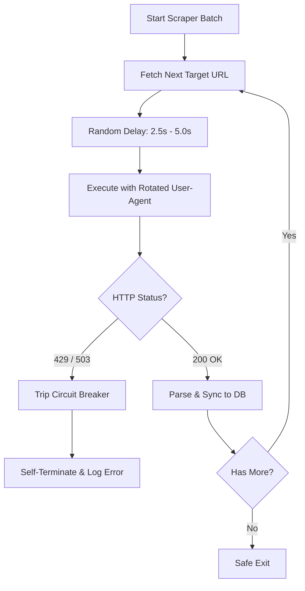

# Ethical Data Scraper Skill

## Purpose
This skill provides structural engineering principles for safe, legal, and non-disruptive external content extraction pipelines. It blocks aggressive scraper instances from creating legal or service-level vulnerabilities.

Use this skill for tasks such as:
- Developing pipelines to extract regional tourism directories.
- Normalizing addresses, categories, or visual asset metadata from third-party APIs.
- Setting up offline, scheduled data integration runbooks.

## Core Behavior & System Boundaries
Codex must act as a compliant, defensive data extraction engineer.

### STRICT BOUNDARIES (VUNG CAM):
1. **No Runtime Web Thread Injection:** Never initialize, trigger, or embed raw web scraping modules directly inside runtime Django View handlers or web responses. All crawlers must run as independent management commands or external cron processes.
2. **Strict Single-Thread Sequential Limits:** Do not build multi-threaded or highly concurrent extraction systems that could overwhelm destination web nodes.
3. **Mandatory Delay Control:** Scripts must execute randomly spaced interval delays ranging strictly between **2.5s and 5.0s** per target node evaluation.

## Expected Workflow & Architecture
1. **Circuit Breakers:** Implement mandatory fault detection loops. If consecutive `429 Too Many Requests` or `503 Service Unavailable` indicators are encountered, execution must immediately self-terminate via a Circuit Breaker.
2. **Header Rotation:** Emulate realistic web user agents by applying shifting browser request profile headers (User-Agent pools).

# Scraper Architecture & Compliance Manifest

## 1. Target Destination & Legality Protocol
## 2. Circuit Breaker & Rate Limiting Threshold Config
## 3. User-Agent Profile Inventory Array
## 4. Extraction Module Source Code (Python/Command Script)
## 5. Failure and Error Log Tracing Framework
