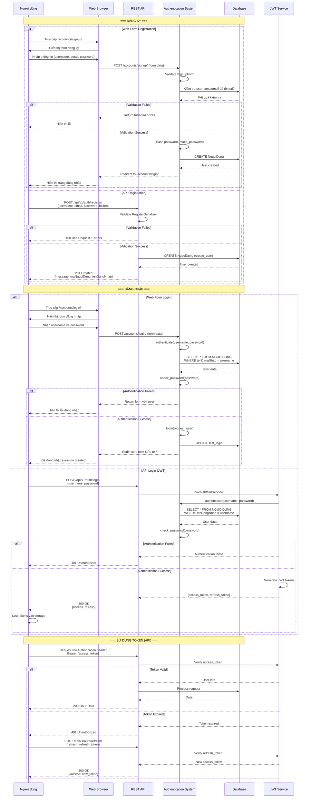

# Sơ đồ Luồng Đăng Nhập và Đăng Ký

## 1. Luồng Đăng Ký (Registration Flow)

```mermaid
flowchart TD
    Start([Người dùng truy cập trang đăng ký]) --> ChooseMethod{Chọn phương thức}
    
    ChooseMethod -->|Web Form| WebSignup[Trang /accounts/signup/]
    ChooseMethod -->|API| APISignup[POST /api/v1/auth/register/]
    
    %% Web Form Flow
    WebSignup --> WebForm[Hiển thị SignupForm]
    WebForm --> FillForm[Nhập thông tin:<br/>- Username<br/>- Email<br/>- Password<br/>- Confirm Password]
    FillForm --> ValidateWeb{Validate Form}
    ValidateWeb -->|Invalid| ShowErrors[Hiển thị lỗi validation]
    ShowErrors --> FillForm
    ValidateWeb -->|Valid| CreateUserWeb[Tạo NguoiDung object]
    
    %% API Flow
    APISignup --> ValidateAPI{Validate Request Data}
    ValidateAPI -->|Invalid| Return400[Return 400 Bad Request<br/>+ Error details]
    ValidateAPI -->|Valid| CreateUserAPI[RegisterSerializer.create]
    
    %% Common Flow
    CreateUserWeb --> HashPassword[Băm mật khẩu<br/>make_password]
    CreateUserAPI --> HashPassword
    HashPassword --> SaveDB[(Lưu vào Database<br/>NGUOIDUNG table)]
    
    SaveDB --> CheckSuccess{Thành công?}
    CheckSuccess -->|No| ReturnError[Return Error]
    CheckSuccess -->|Yes| Success
    
    %% Web Success
    Success -->|Web| RedirectLogin[Redirect to /accounts/login/]
    RedirectLogin --> EndWeb([Hiển thị trang đăng nhập])
    
    %% API Success
    Success -->|API| Return201[Return 201 Created<br/>{<br/>  message: 'Đăng ký thành công',<br/>  maNguoiDung: user.id,<br/>  tenDangNhap: user.username<br/>}]
    Return201 --> EndAPI([Client nhận response])
    
    style Start fill:#e1f5ff
    style EndWeb fill:#c8e6c9
    style EndAPI fill:#c8e6c9
    style Return400 fill:#ffcdd2
    style ReturnError fill:#ffcdd2
```

## 2. Luồng Đăng Nhập (Login Flow)

```mermaid
flowchart TD
    Start([Người dùng truy cập trang đăng nhập]) --> ChooseMethod{Chọn phương thức}
    
    ChooseMethod -->|Web Form| WebLogin[Trang /accounts/login/]
    ChooseMethod -->|API| APILogin[POST /api/v1/auth/login/]
    
    %% Web Form Flow
    WebLogin --> WebForm[Hiển thị Login Form]
    WebForm --> EnterCreds[Nhập thông tin:<br/>- Username<br/>- Password]
    EnterCreds --> SubmitWeb[Submit Form]
    SubmitWeb --> AuthenticateWeb[Django authenticate]
    
    %% API Flow
    APILogin --> ValidateAPI{Validate Request Data}
    ValidateAPI -->|Invalid| Return400[Return 400 Bad Request]
    ValidateAPI -->|Valid| AuthenticateAPI[TokenObtainPairView<br/>authenticate user]
    
    %% Common Authentication
    AuthenticateWeb --> CheckCreds{Thông tin đúng?}
    AuthenticateAPI --> CheckCreds
    
    CheckCreds -->|No| InvalidCreds[Thông tin không đúng]
    InvalidCreds -->|Web| ShowError[Hiển thị lỗi đăng nhập]
    InvalidCreds -->|API| Return401[Return 401 Unauthorized<br/>{detail: 'No active account...'}]
    ShowError --> EnterCreds
    Return401 --> EndAPIError([Client nhận lỗi])
    
    CheckCreds -->|Yes| UserActive{User is_active?}
    UserActive -->|No| AccountInactive[Tài khoản bị vô hiệu hóa]
    AccountInactive -->|Web| ShowInactiveError[Hiển thị lỗi tài khoản]
    AccountInactive -->|API| Return401Inactive[Return 401 Unauthorized]
    ShowInactiveError --> EnterCreds
    Return401Inactive --> EndAPIError
    
    UserActive -->|Yes| Success
    
    %% Web Success Flow
    Success -->|Web| LoginUser[Django login user<br/>create session]
    LoginUser --> GetNextURL{Lấy next parameter?}
    GetNextURL -->|Có| RedirectNext[Redirect to next URL]
    GetNextURL -->|Không| RedirectHome[Redirect to /]
    RedirectNext --> EndWeb([Người dùng đã đăng nhập<br/>Session được tạo])
    RedirectHome --> EndWeb
    
    %% API Success Flow
    Success -->|API| GenerateTokens[Generate JWT Tokens:<br/>- Access Token<br/>- Refresh Token]
    GenerateTokens --> Return200[Return 200 OK<br/>{<br/>  access: 'eyJ0eXAiOiJKV1QiLCJ...',<br/>  refresh: 'eyJ0eXAiOiJKV1QiLCJ...'<br/>}]
    Return200 --> EndAPISuccess([Client nhận tokens<br/>Lưu vào localStorage/sessionStorage])
    
    style Start fill:#e1f5ff
    style EndWeb fill:#c8e6c9
    style EndAPISuccess fill:#c8e6c9
    style Return400 fill:#ffcdd2
    style Return401 fill:#ffcdd2
    style Return401Inactive fill:#ffcdd2
    style EndAPIError fill:#ffcdd2
```

## 3. Luồng Tổng Hợp - Đăng Ký và Đăng Nhập



## 4. Cấu trúc Dữ liệu

### Request/Response Formats

#### Đăng Ký (API)
**Request:**
```json
POST /api/v1/auth/register/
{
  "username": "nguyenvana",
  "email": "nguyenvana@example.com",
  "password": "password123",
  "hoTen": "Nguyễn Văn A"
}
```

**Response (Success):**
```json
{
  "message": "Đăng ký thành công",
  "maNguoiDung": 1,
  "tenDangNhap": "nguyenvana"
}
```

**Response (Error):**
```json
{
  "username": ["A user with that username already exists."],
  "email": ["user with this email already exists."]
}
```

#### Đăng Nhập (API)
**Request:**
```json
POST /api/v1/auth/login/
{
  "username": "nguyenvana",
  "password": "password123"
}
```

**Response (Success):**
```json
{
  "access": "eyJ0eXAiOiJKV1QiLCJhbGc...",
  "refresh": "eyJ0eXAiOiJKV1QiLCJhbGc..."
}
```

**Response (Error):**
```json
{
  "detail": "No active account found with the given credentials"
}
```

## 5. Bảng Database Schema

### NGUOIDUNG Table
```sql
CREATE TABLE NGUOIDUNG (
    maNguoiDung INTEGER PRIMARY KEY AUTOINCREMENT,
    tenDangNhap VARCHAR(150) UNIQUE NOT NULL,
    email VARCHAR(255) UNIQUE NOT NULL,
    password VARCHAR(128) NOT NULL,  -- Hashed by Django
    hoTen VARCHAR(255),
    soDienThoai VARCHAR(20),
    anhDaiDien VARCHAR(500),
    ngaySinh DATE,
    gioiTinh VARCHAR(10),
    diaChi TEXT,
    vaiTro VARCHAR(20) DEFAULT 'user',
    trangThai VARCHAR(20) DEFAULT 'active',
    is_active BOOLEAN DEFAULT 1,
    is_staff BOOLEAN DEFAULT 0,
    is_superuser BOOLEAN DEFAULT 0,
    last_login DATETIME,
    date_joined DATETIME DEFAULT CURRENT_TIMESTAMP
);
```

## 6. Security Features

1. **Password Hashing**: Sử dụng Django's password hasher (PBKDF2)
2. **JWT Tokens**: Access token (2h) và Refresh token (7 days)
3. **CSRF Protection**: Cho web forms
4. **Session Security**: HttpOnly cookies cho web
5. **Input Validation**: Validate tất cả input trước khi xử lý
6. **SQL Injection Protection**: Sử dụng Django ORM

## 7. Endpoints Summary

| Method | Endpoint | Description | Auth Required |
|--------|----------|-------------|---------------|
| GET | `/accounts/signup/` | Hiển thị form đăng ký | No |
| POST | `/accounts/signup/` | Xử lý đăng ký (web) | No |
| GET | `/accounts/login/` | Hiển thị form đăng nhập | No |
| POST | `/accounts/login/` | Xử lý đăng nhập (web) | No |
| POST | `/api/v1/auth/register/` | Đăng ký (API) | No |
| POST | `/api/v1/auth/login/` | Đăng nhập (API) | No |
| POST | `/api/v1/auth/refresh/` | Refresh access token | No |
| POST | `/accounts/logout/` | Đăng xuất (web) | Yes |
| GET | `/accounts/profile/` | Xem/sửa profile | Yes |

