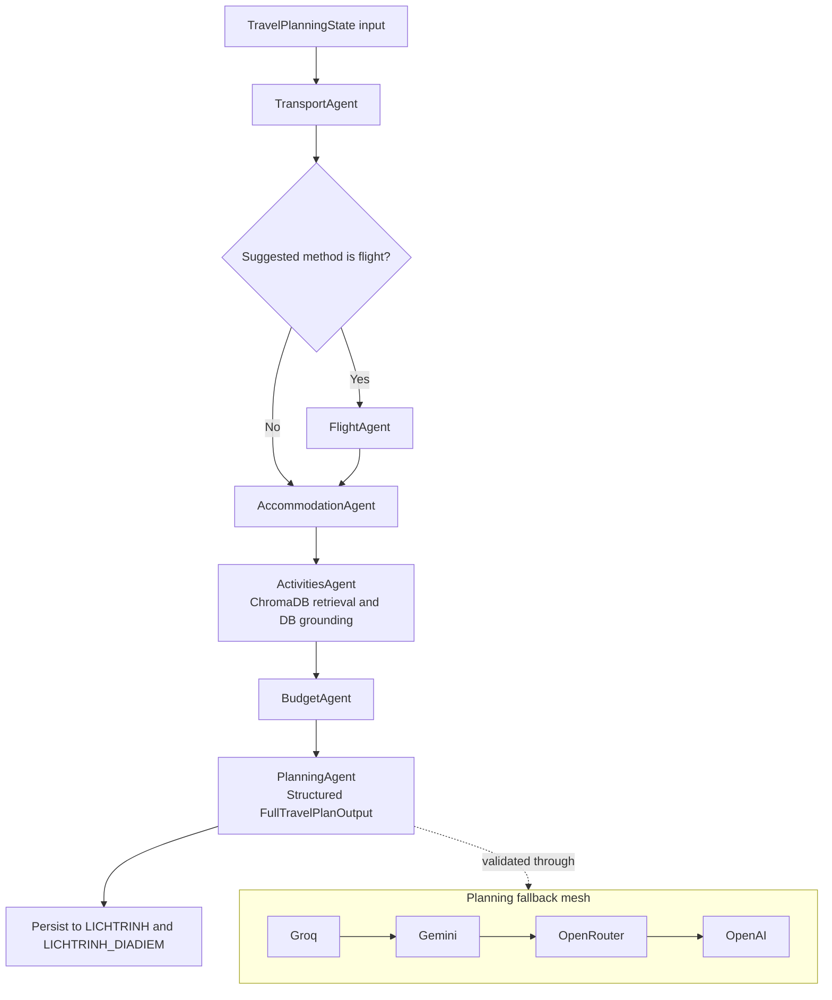
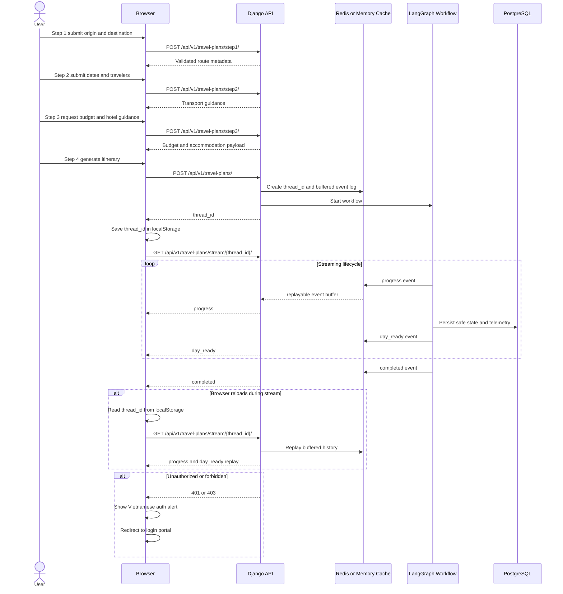

# Vi Vu - Premium Space-Aware AI Travel Operating System

Vi Vu is a production-oriented AI travel planning platform for Vietnam. It combines a Django 5 API core, a LangGraph orchestration engine, PostgreSQL-backed relational storage, ChromaDB semantic retrieval, Redis-powered state persistence, and a glassmorphic Aether Deep Ocean frontend.

The system is designed to guide authenticated users through a four-step itinerary workflow, generate structured day-by-day travel plans through a six-node multi-agent graph, stream progress back to the browser through Server-Sent Events, and persist the final itinerary into normalized relational tables without breaking ownership or validation boundaries.

## Core Stack

| Layer | Technology | Role |
|---|---|---|
| Web framework | Django 5, Django REST Framework | API contracts, authentication, admin, templates |
| Agent orchestration | LangGraph, LangChain | Stateful itinerary workflow and fallback coordination |
| Primary relational store | PostgreSQL 16 | Production data for users, places, itineraries, analytics |
| Semantic retrieval | ChromaDB | Vector search and grounding for place discovery |
| Cache and checkpointing | Redis | Rate limiting, workflow state replay, stream resume |
| Frontend | Django templates, Vanilla JavaScript, Tailwind-style utilities | Landing page, discovery hub, chat workspace, four-step wizard |
| Infrastructure | Docker Compose, GitHub Actions | Container runtime, CI validation, delivery blueprint |

## Repository Layout

| Path | Purpose |
|---|---|
| [vivu_backend](/D:/cv/project/TRAVEL_PLANNER/vivu_backend) | Django project, apps, agents, tools, scripts, tests |
| [vivu_frontend](/D:/cv/project/TRAVEL_PLANNER/vivu_frontend) | Canonical templates, static CSS, JavaScript, images, video |
| [docker-compose.yml](/D:/cv/project/TRAVEL_PLANNER/docker-compose.yml) | PostgreSQL, Redis, Chroma, web runtime topology |
| [Dockerfile](/D:/cv/project/TRAVEL_PLANNER/Dockerfile) | Multi-stage Python 3.11 image with non-root runtime |
| [requirements.txt](/D:/cv/project/TRAVEL_PLANNER/requirements.txt) | Python application, AI, database, and test dependencies |
| [.github/workflows/production-pipeline.yml](/D:/cv/project/TRAVEL_PLANNER/.github/workflows/production-pipeline.yml) | CI pipeline blueprint for lint, tests, and image build |

## Active Production Data Model

The current production schema operates on 11 active relational models.

| Model | App | Main Role | Key Relationships |
|---|---|---|---|
| `TinhThanh` | `apps.places` | Master administrative region | Parent of `DiaDiem`, `LichTrinh`, `YeuCauLoTrinh` |
| `DiaDiem` | `apps.places` | Core place of interest record | FK to `TinhThanh`; linked to reviews, favorites, itineraries, contributions |
| `HinhAnhDiaDiem` | `apps.places` | Place image registry | FK to `DiaDiem` |
| `DanhGia` | `apps.places` | User review and rating | FK to `DiaDiem` and `NguoiDung` |
| `DiaDiemYeuThich` | `apps.places` | User favorites junction | FK to `DiaDiem` and `NguoiDung` |
| `NguoiDung` | `apps.users` | Custom authenticated user model | Owns itineraries, search history, contributions, analytics records |
| `LichSuTimKiem` | `apps.users` | Search activity history | FK to `NguoiDung`; optional FK to `DiaDiem` |
| `LichTrinh` | `apps.itineraries` | Unified itinerary header | FK to `NguoiDung` and `TinhThanh`; stores canonical itinerary JSON |
| `LichTrinhDiaDiem` | `apps.itineraries` | Day-level itinerary place junction | FK to `LichTrinh` and `DiaDiem`; unique by itinerary, place, and visit date |
| `DongGop` | `apps.itineraries` | User contribution and POI proposal queue | FK to `NguoiDung`; optional FK to `DiaDiem`; stores structured proposal JSON |
| `YeuCauLoTrinh` | `apps.analytics` | Workflow telemetry ledger | FK to `NguoiDung`; optional origin and destination `TinhThanh` links |

## Multi-Agent Lifecycle

Step 4 itinerary generation is coordinated by the LangGraph workflow defined in [langgraph_workflow.py](/D:/cv/project/TRAVEL_PLANNER/vivu_backend/agents/langgraph_workflow.py) and backed by the shared state schema in [state.py](/D:/cv/project/TRAVEL_PLANNER/vivu_backend/agents/state.py).



### Agent Responsibilities

| Agent | Responsibility |
|---|---|
| `TransportAgent` | Geocoding, distance estimation, route feasibility, transport recommendation |
| `FlightAgent` | Conditional flight search and flight cost enrichment |
| `AccommodationAgent` | Hotel discovery, stay selection, accommodation budgeting |
| `ActivitiesAgent` | Activity and restaurant retrieval with relational grounding and vector assistance |
| `BudgetAgent` | Budget allocation, category rollups, emergency buffer planning |
| `PlanningAgent` | Structured itinerary assembly, fallback validation, final travel narrative |

## Client-to-Server Event Lifecycle

The browser flow is driven by [travel_plan_workflow.js](/D:/cv/project/TRAVEL_PLANNER/vivu_frontend/static/js/travel_plan_workflow.js), while streaming is served by [travel_plan_streaming.py](/D:/cv/project/TRAVEL_PLANNER/vivu_backend/utils/travel_plan_streaming.py).



## Runtime Services

The production-oriented container topology is defined in [docker-compose.yml](/D:/cv/project/TRAVEL_PLANNER/docker-compose.yml).

| Service | Image | Role |
|---|---|---|
| `db` | `postgres:16-alpine` | Primary relational database |
| `redis` | `redis:7-alpine` | Cache, throttle store, checkpoint and stream replay |
| `chroma` | `chromadb/chroma:latest` | Persistent vector index service |
| `web` | Built from local `Dockerfile` | Django application runtime |

### Unified Chroma Persistence

The repository previously carried multiple live vector store candidates. The active runtime now standardizes on one environment-controlled path:

- `CHROMA_PERSIST_DIRECTORY=vector_db_data`

This value is shared by:

- [docker-compose.yml](/D:/cv/project/TRAVEL_PLANNER/docker-compose.yml) for the Chroma bind mount
- [settings.py](/D:/cv/project/TRAVEL_PLANNER/vivu_backend/vivu_core/settings.py) for Django runtime defaults
- [vector_db.py](/D:/cv/project/TRAVEL_PLANNER/vivu_backend/agents/travel_agents/vector_db.py) for local fallback resolution

## Docker Build Strategy

The root [Dockerfile](/D:/cv/project/TRAVEL_PLANNER/Dockerfile) uses a multi-stage layout.

| Stage | Purpose |
|---|---|
| `builder` | Create virtual environment, install dependencies, copy source, collect static assets |
| `runtime` | Ship a minimal non-root image with the prepared virtual environment and collected static output |

### Security and Build Hardening

- Base image pinned to `python:3.11-slim`
- Dedicated non-privileged runtime user `appuser`
- `.env` and live vector stores excluded from build context by [.dockerignore](/D:/cv/project/TRAVEL_PLANNER/.dockerignore)
- Static assets collected during image build with `python vivu_backend/manage.py collectstatic --noinput`

## CI/CD Blueprint

The GitHub Actions blueprint lives at [.github/workflows/production-pipeline.yml](/D:/cv/project/TRAVEL_PLANNER/.github/workflows/production-pipeline.yml).

### Pipeline Stages

| Job | Purpose |
|---|---|
| `lint` | Install dependencies, run fatal Flake8 gate, compile critical Python modules |
| `tests` | Run Django system checks and the protected 16-test integration suite |
| `docker-build` | Validate rendered Compose configuration and build the production image |
| `deployment-notify` | Emit a deployment-ready notice on `main` after successful validation |

### Protected Test Modules

- `apps.api.tests.test_end_to_end_workflows`
- `apps.api.tests.test_database_crud`
- `apps.api.tests.test_travel_plan_auth`
- `tests.test_save_travel_plan_view`

## Production Installation Runbook

### 1. Prepare environment variables

Create a root `.env` file from [`.env.example`](/D:/cv/project/TRAVEL_PLANNER/.env.example) and fill in production credentials.

Required keys:

- `DJANGO_SECRET_KEY`
- `POSTGRES_DB`
- `POSTGRES_USER`
- `POSTGRES_PASSWORD`
- `DATABASE_NAME`
- `DATABASE_USER`
- `DATABASE_PASSWORD`
- `DATABASE_HOST`
- `DATABASE_PORT`
- `REDIS_HOST`
- `REDIS_PORT`
- `CHROMA_HOST`
- `CHROMA_PORT`
- `CHROMA_URL`
- `CHROMA_PERSIST_DIRECTORY`
- provider keys such as `GROQ_API_KEY`, `GEMINI_API_KEY`, `OPENROUTER_API_KEY`, and `OPENWEATHER_API_KEY` when those providers are enabled

### 2. Build and start the stack

```bash
docker compose up --build -d
```

### 3. Run migrations

```bash
docker compose exec web python vivu_backend/manage.py migrate --noinput
```

### 4. Create an administrative account

```bash
docker compose exec web python vivu_backend/manage.py createsuperuser
```

### 5. Seed deterministic test fixtures when needed

Dry run:

```bash
docker compose exec web python vivu_backend/scripts/seed_test_fixtures.py
```

Apply fixtures:

```bash
docker compose exec web python vivu_backend/scripts/seed_test_fixtures.py --apply
```

### 6. Run the protected test suite

```bash
docker compose exec web sh -c "cd vivu_backend && python manage.py test apps.api.tests.test_end_to_end_workflows apps.api.tests.test_database_crud apps.api.tests.test_travel_plan_auth tests.test_save_travel_plan_view --verbosity 1"
```

## Local Development Verification

The repository keeps a deterministic SQLite test mode for fast local verification.

```powershell
$env:DATABASE_ENGINE='django.db.backends.sqlite3'
py -3.11 manage.py check
py -3.11 manage.py test apps.api.tests.test_end_to_end_workflows apps.api.tests.test_database_crud apps.api.tests.test_travel_plan_auth tests.test_save_travel_plan_view --verbosity 1
```

Run those commands from [vivu_backend](/D:/cv/project/TRAVEL_PLANNER/vivu_backend).

## Frontend Surface Summary

| Screen | Canonical Template |
|---|---|
| Landing page | [index.html](/D:/cv/project/TRAVEL_PLANNER/vivu_frontend/templates/index.html) |
| Discovery hub | [discovery.html](/D:/cv/project/TRAVEL_PLANNER/vivu_frontend/templates/places/discovery.html) |
| AI chat workspace | [ai_chat.html](/D:/cv/project/TRAVEL_PLANNER/vivu_frontend/templates/ai_chat.html) |
| Four-step itinerary wizard | [travel_plan.html](/D:/cv/project/TRAVEL_PLANNER/vivu_frontend/templates/travel_plan.html) |

The shared shell and navigation layer are defined in:

- [base.html](/D:/cv/project/TRAVEL_PLANNER/vivu_frontend/templates/base.html)
- [navbar.html](/D:/cv/project/TRAVEL_PLANNER/vivu_frontend/templates/includes/navbar.html)
- [footer.html](/D:/cv/project/TRAVEL_PLANNER/vivu_frontend/templates/includes/footer.html)
- [main.css](/D:/cv/project/TRAVEL_PLANNER/vivu_frontend/static/css/main.css)
- [navbar.js](/D:/cv/project/TRAVEL_PLANNER/vivu_frontend/static/js/navbar.js)

## Operational Notes

- The protected backend flow assumes authenticated access for itinerary generation and save operations.
- Streaming state replay is keyed by `thread_id` and resumed client-side through `localStorage`.
- Vector search degrades safely when Chroma is unavailable, while itinerary generation continues through fallback paths.
- The codebase preserves `scripts/root_legacy` for historical tooling and auditability.

## License

This repository should follow the license terms configured by the project owners. Add the canonical license file if public redistribution is planned.
